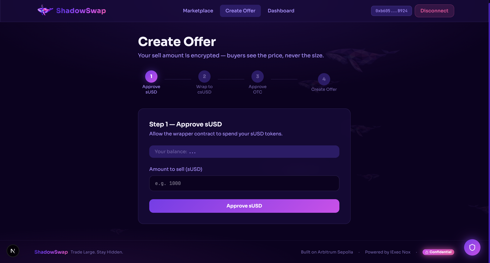
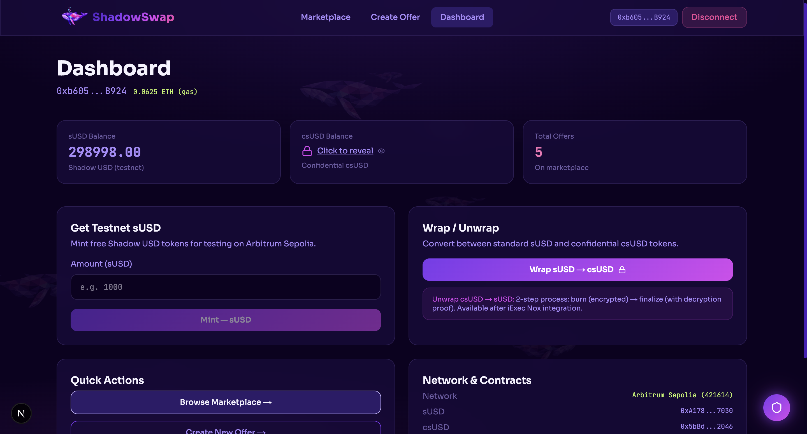
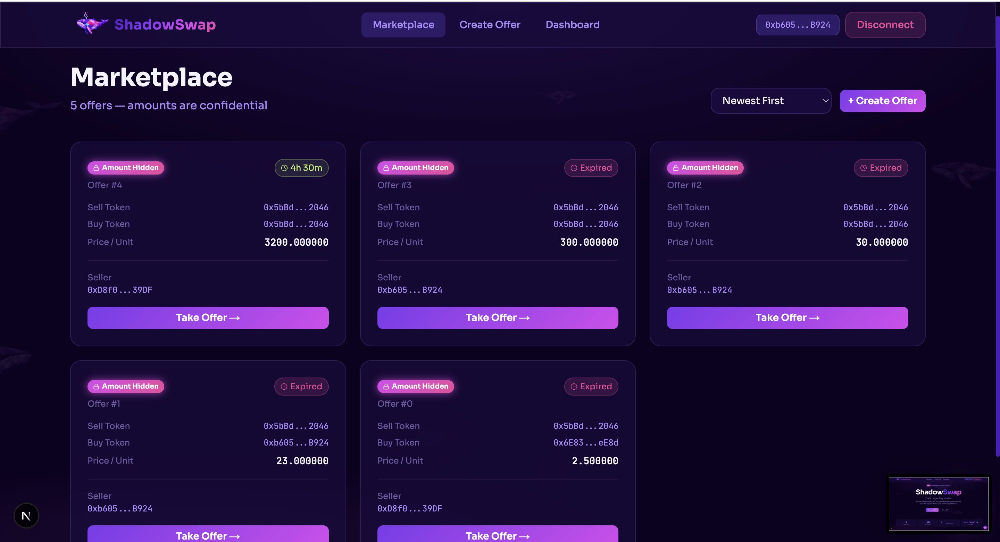
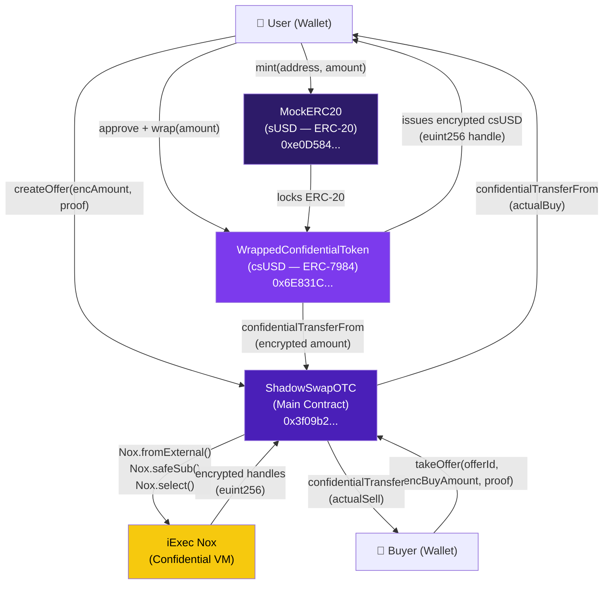
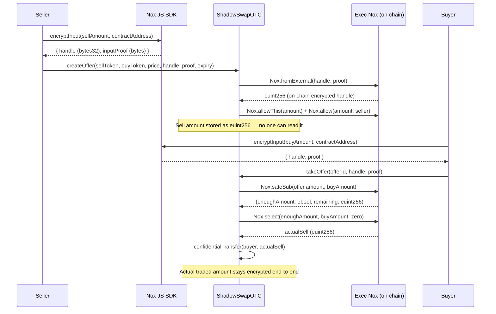

# ShadowSwap

> **Trade Large. Stay Hidden.**

[](https://nextjs.org)
[](https://soliditylang.org)
[](https://arbitrum.io)
[](https://iex.ec)
[](LICENSE)

ShadowSwap is a decentralized **confidential OTC (Over-The-Counter) trading desk** where crypto whales can buy and sell large token amounts without anyone seeing their order sizes. Trade amounts are encrypted on-chain using iExec Nox confidential tokens — MEV bots see nothing.

---

## The Problem

MEV (Maximal Extractable Value) bots front-run large trades on public DEXs, costing traders an estimated **$900M+ per year**. Every time a whale submits a large order, bots read the mempool, jump ahead of the trade, and extract value before the original transaction settles.

## The Solution

ShadowSwap hides order sizes using **iExec Nox ERC-7984 confidential tokens**. The sell amount is encrypted before it ever touches the chain. On-chain, the encrypted handle is an opaque value, no one, including miners and validators, can read the actual trade size.

| Public DEX | ShadowSwap |
|---|---|
| Order size visible in mempool | Order size encrypted (iExec Nox) |
| MEV bots can front-run | Nothing to front-run — size is hidden |
| Large trades cause slippage | OTC matching, no AMM slippage |

---

## Screenshots

> _Screenshots will be added after UI finalization._

| Landing Page | Dashboard | Marketplace |
|---|---|---|
|  |  |  |

| Create Offer | Trade / Take Offer |
|---|---|
|  |  |

---

## Tech Stack

| Layer | Technology |
|---|---|
| Frontend Framework | Next.js 14 (App Router) |
| Language | TypeScript |
| Styling | Tailwind CSS |
| Wallet Connection | wagmi v2 + viem v2 |
| Confidential Tokens (JS) | `@iexec-nox/handle` |
| Smart Contracts | Solidity 0.8.28 |
| Nox Protocol | `@iexec-nox/nox-protocol-contracts` |
| Nox Token Standard | `@iexec-nox/nox-confidential-contracts` |
| Contract Framework | Hardhat |
| Network | Arbitrum Sepolia (Chain ID: 421614) |

---

## Smart Contract Architecture



### Encryption Flow — Step by Step



---

## How iExec Nox Confidential Tokens Work

iExec Nox implements [ERC-7984](https://eips.ethereum.org/EIPS/eip-7984), an encrypted token standard where balances and transfer amounts are stored as **`euint256` handles** — opaque references to values that only exist in encrypted form on-chain.

### Key Nox Primitives Used in ShadowSwap

| Primitive | What It Does in ShadowSwap |
|---|---|
| `Nox.fromExternal(handle, proof)` | Converts the seller/buyer's encrypted input into an on-chain `euint256` handle |
| `Nox.safeSub(a, b)` | Deducts the buy amount from offer balance — returns `(ebool success, euint256 result)` without reverting |
| `Nox.select(cond, ifTrue, ifFalse)` | If enough balance: transfer `buyAmount`; else transfer `0` — all encrypted |
| `Nox.allowThis(handle)` | Grants the OTC contract permission to operate on an encrypted value |
| `Nox.allow(handle, addr)` | Grants the seller/buyer permission to later decrypt their own handles |
| `Nox.toEuint256(0)` | Initializes the encrypted `filled` counter at offer creation |

### Why No Reverts on Insufficient Balance

Traditional `require(balance >= amount)` leaks information — the revert itself reveals that the balance is below the requested amount. Nox uses `safeSub` + `select` instead: if balance is insufficient, the actual transferred amount silently becomes `0`. No revert. No information leak. MEV bots learn nothing.

---

## Contract Addresses (Arbitrum Sepolia)

| Contract | Address | Purpose |
|---|---|---|
| `MockERC20` (sUSD) | `0xA1782fe2C2969C2787315b906eca2E8019557030` | Test ERC-20 — freely mintable |
| `WrappedConfidentialToken` (csUSD) | `0x5bBd253DcA6aA5Ca4Af3b3dc351a590eCaa12046` | Wraps sUSD into confidential ERC-7984 |
| `ShadowSwapOTC` | `0x168380D79dea19E7d3B4Bcc1f6766f5580337034` | Core OTC matching contract |

---

## Installation

### Prerequisites

- Node.js 18+
- npm 9+
- MetaMask (or any EIP-1193 wallet) set to **Arbitrum Sepolia**
- Testnet ETH on Arbitrum Sepolia for gas fees

### 1. Clone & Install

```bash
git clone https://github.com/Uhiene/shadow-swap
cd shadowswap
npm install
```

### 2. Environment Setup

Create `.env.local` in the project root:

```env
# Deployer private key — testnet only, never use a funded mainnet key
PRIVATE_KEY=your_private_key_here

# Contract addresses (filled in after deploy)
NEXT_PUBLIC_MOCK_ERC20_ADDRESS=
NEXT_PUBLIC_WRAPPED_CONFIDENTIAL_TOKEN_ADDRESS=
NEXT_PUBLIC_SHADOW_SWAP_OTC_ADDRESS=
```

### 3. Compile Contracts

```bash
npx hardhat compile
```

### 4. Deploy to Arbitrum Sepolia

```bash
npx hardhat run scripts/deploy.ts --network arbitrumSepolia
```

Copy the printed addresses into `lib/contracts.ts`:

```ts
export const CONTRACT_ADDRESSES = {
  MOCK_ERC20: '0x...',
  WRAPPED_CONFIDENTIAL_TOKEN: '0x...',
  SHADOW_SWAP_OTC: '0x...',
};
```

### 5. Run the Frontend

```bash
npm run dev
```

Open [http://localhost:3000](http://localhost:3000).

---

## How to Use

### Step 1 — Connect Wallet & Switch to Arbitrum Sepolia

Click **Connect Wallet** in the navbar. If MetaMask is on the wrong network, the Dashboard will show a red **"Wrong network"** banner — click **Switch Network** to switch automatically.

> Note: Arbitrum Sepolia and Ethereum Sepolia share the same wallet address but are different chains. ETH from a Sepolia faucet does **not** appear on Arbitrum Sepolia. Use an Arbitrum Sepolia-specific faucet.

### Step 2 — Get Testnet ETH for Gas

Visit `faucet.triangleplatform.com/arbitrum/sepolia` and paste your wallet address. A small amount (0.001 ETH) is enough for many transactions.

### Step 3 — Mint Test sUSD

Go to **Dashboard → Get Testnet sUSD**, enter an amount (e.g. `10000`), and click **Mint**. This creates free test tokens with no real value.

### Step 4 — Wrap sUSD into csUSD (Confidential Tokens)

Go to **Create Offer → Wrap**. Approve the sUSD spend, then wrap into **csUSD**. After wrapping, your balance is encrypted on-chain — on-chain observers see only an opaque handle, not the actual amount.

### Step 5 — Create a Sell Offer

Fill in the Create Offer form with your sell token, buy token, price per unit, encrypted amount, and expiry. Submit — the encrypted amount is committed to the OTC contract. Marketplace visitors can see the offer exists but **cannot see the trade size**.

### Step 6 — Browse the Marketplace

All active offers are listed at `/marketplace`. Order sizes display as **🔒 Amount Hidden**. Sellers, prices, and expiry times are public.

### Step 7 — Take an Offer

Click any offer to open the trade page. Enter your desired buy amount, ensure your buy tokens are wrapped as csUSD, and submit. The contract uses encrypted arithmetic (`Nox.safeSub` + `Nox.select`) to settle — your amount also stays hidden.

### Step 8 — Check Your Dashboard

After a completed trade, your **Reputation** (trade count) increments for both parties. csUSD balance is shown as 🔒 since it is encrypted.

---

## Project Structure

```
shadowswap/
├── app/
│   ├── layout.tsx              # Root layout, providers, fonts
│   ├── page.tsx                # Landing page
│   ├── marketplace/page.tsx    # Browse active offers
│   ├── create/page.tsx         # Create a new offer
│   ├── trade/[id]/page.tsx     # Take / fill an offer
│   └── dashboard/page.tsx      # Balances, mint, wrap
├── components/
│   ├── Navbar.tsx
│   ├── Providers.tsx           # wagmi + React Query providers
│   ├── GlowButton.tsx
│   └── CrystalBackground.tsx
├── hooks/
│   └── useNoxHandle.ts         # Encrypt/decrypt via Nox JS SDK
├── lib/
│   ├── contracts.ts            # Deployed addresses
│   ├── abi.ts                  # Contract ABIs
│   ├── config.ts               # wagmi chain + RPC config
│   └── utils.ts                # Formatters, helpers
├── contracts/
│   ├── MockERC20.sol
│   ├── WrappedConfidentialToken.sol
│   └── ShadowSwapOTC.sol
├── scripts/
│   └── deploy.ts
└── hardhat.config.ts
```

---

## Team

| Name | Role | Contact |
|---|---|---|
| _Code Duchess_ | Founder & Full-Stack | [@yourhandle](#) |

---

## Built At

> _iExec Vibe Coding Challenge · 4/4/2026 ·_

---


<div align="center">
  <strong>ShadowSwap — Trade Large. Stay Hidden.</strong><br/>
  Built with iExec Nox · Deployed on Arbitrum Sepolia
</div>
